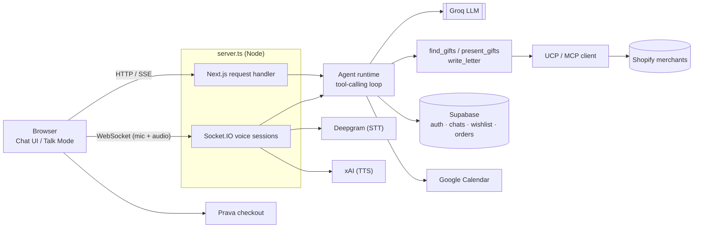
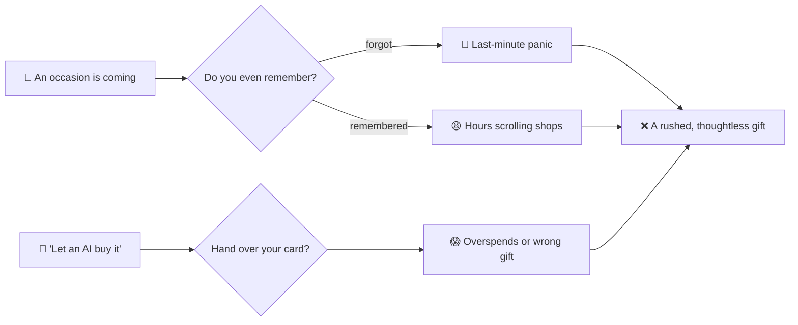
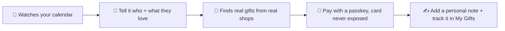
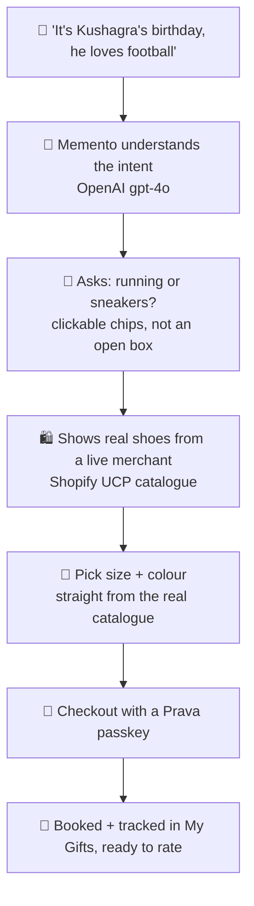
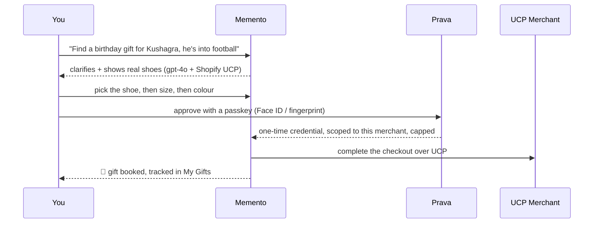
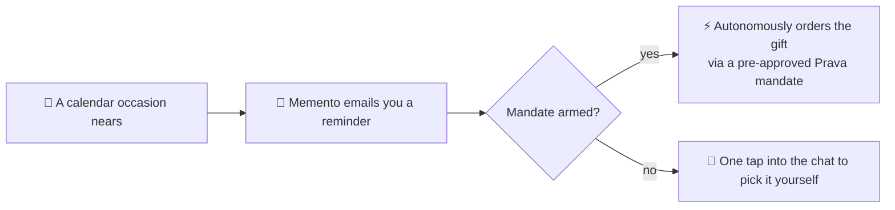

<<<<<<< HEAD
<div align="center">
=======
<p align="center">
  
</p>

<h1 align="center">Memento</h1>

Memento is an AI relationship agent — a chat (and voice) assistant that helps you find, personalize, and check out a thoughtful gift for someone in your life, instead of just searching a product catalog.

## Overview

Instead of asking "what mug should I buy," you tell Memento about the *person* — who they are to you, what they're into, the occasion, the budget — and it does the rest: searches real merchant catalogs, picks a short list that actually fits (not just keyword matches), writes a personal note if you want one, and lets you check out with one tap. It also knows your upcoming Google Calendar occasions, so it can proactively bring up a birthday or anniversary before you ask.

Built during a hackathon — some parts (e.g. Prava checkout) run against a sandbox, and scope is intentionally kept tight (see `AGENTS.md`).

## Features

- **Conversational gift-finding** — a tool-calling LLM agent (Groq) that asks for what it's missing (relationship, interests, budget), searches, and narrows to 3–4 genuinely good picks instead of dumping a keyword-matched list.
- **Talk Mode** — a real voice conversation (speech-to-text via Deepgram, text-to-speech via xAI) over a WebSocket, with barge-in interruption and clickable option chips for quick answers.
- **Real merchant catalogs** — gift search fans out in parallel to real Shopify stores over the [UCP](https://shopify.dev/ucp) (Universal Commerce Protocol) / MCP, not a static/mock product list. See `lib/merchants.ts` for the current catalog list.
- **Agentic checkout (Prava)** — one-tap checkout against a sandboxed payment flow; the buyer's real card never touches Memento or the merchant. No real money moves.
- **Wishlist** — heart any gift card to save it; un-hearting it removes it from the wishlist view live.
- **Chat history** — signed-in users get persisted conversations; guests can chat without an account and their session gets imported on sign-up.
- **Google Calendar awareness** — connect your calendar (Supabase-managed Google OAuth) and Memento can proactively surface the nearest upcoming occasion.
- **Personalized letters** — once you approve a gift, the agent can write a warm, specific card message addressed to the recipient.

<p align="center">
  
  <br />
  <sub>The mascot that greets you on empty states — chat, wishlist, login, and Talk Mode each get their own pose.</sub>
</p>

## Tech Stack

- **Framework**: Next.js (App Router, Turbopack) + React + TypeScript
- **Styling**: Tailwind CSS
- **Backend**: a custom Node server (`server.ts`) wrapping Next.js so it can also host a Socket.IO server for Talk Mode
- **LLM**: Groq (`llama-3.3-70b-versatile` by default) with tool-calling for `find_gifts` / `present_gifts` / `present_options` / `write_letter`
- **Auth & data**: Supabase (auth, Postgres tables for conversations, orders, wishlist, saved addresses, Google Calendar tokens)
- **Voice**: Deepgram (STT) + xAI (TTS)
- **Commerce**: Shopify UCP/MCP for merchant search, [Prava](https://prava.space) sandbox for checkout

## Architecture



## Project Structure

```text
momento/
├── server.ts                    <-- Custom server: boots Next.js + Socket.IO together
├── app/
│   ├── page.tsx                 <-- Main chat UI (text + Talk Mode entry point)
│   ├── calendar/                <-- Upcoming occasions, powered by Google Calendar
│   ├── wishlist/                <-- Saved gifts
│   ├── my-gifts/                <-- Past orders
│   ├── checkout/                <-- Prava checkout flow
│   ├── login/                   <-- Auth (Supabase)
│   ├── components/               <-- GiftCard, TalkModeOverlay, Sidebar, ProfileModal, etc.
│   ├── hooks/useTalkMode.ts      <-- Talk Mode client-side state machine
│   └── api/
│       ├── chat/route.ts        <-- Text chat endpoint (SSE stream)
│       ├── auth/callback/       <-- Supabase OAuth callback (also stores Google Calendar tokens)
│       └── prava/               <-- Checkout session + result endpoints
├── lib/
│   ├── agent.ts                 <-- System prompt + tool schemas
│   ├── agent-runtime.ts         <-- Shared tool-calling loop (used by chat route + voice session)
│   ├── gifts.ts                 <-- Fans out gift search across merchants
│   ├── merchants.ts             <-- Merchant catalog (UCP endpoints)
│   ├── ucp.ts                   <-- Minimal UCP/MCP client
│   ├── prava.ts                 <-- Prava checkout session helpers
│   ├── calendar.ts              <-- Google Calendar event fetching/formatting
│   ├── voice/                   <-- Client-side audio capture/playback
│   └── supabase/                <-- client/server Supabase helpers, conversations, wishlist, Google tokens
├── server/voice/                <-- Voice session (Socket.IO), Deepgram STT, TTS
└── supabase/*.sql                <-- Schema — run manually in the Supabase SQL editor (no migration tooling)
```
>>>>>>> b4d57cee4a8ea810dad99e36e2ff20a0611c3228


<<<<<<< HEAD
# 🎁 Memento

### Never miss a gift again. Just talk, and it handles the rest.

**Memento is your AI gifting companion. It watches your calendar, reminds you before every
occasion, finds a real gift by just chatting, and pays for it safely with a passkey.
Your card is never exposed, and the agent can never overspend.**

_OpenAI gpt-4o · Prava scoped-credential payments · Shopify UCP merchants · Google Calendar_

🔗 **Live:** https://drape-piyushagarwal-55s-projects.vercel.app

</div>

---

## 😩 The problem

We all forget birthdays and anniversaries. And even when we remember, we lose hours scrolling
shops for something halfway decent. Now the "let an AI buy it for you" tools want you to just hand
over your card and hope it does not overspend or pick the wrong thing.



> The gift is not the hard part. **Remembering, choosing, and trusting** is.

---

## 💡 The solution — Memento

You do not fill forms or scroll grids. You **talk to Memento like a thoughtful friend**, and it does
the remembering, the finding, and the paying, safely.



---

## 🎬 What one session actually feels like

No search bar, no filters. A conversation.



And the flow underneath, end to end:



---

## 📅 The autonomous part — it can remember *for* you

Sign in with Google and Memento reads your **Google Calendar**. Every birthday, anniversary, and
festival is now something it knows about.



> Today it **reminds you and finds the gift in seconds**. Next, with a **Prava mandate** approved once
> by a passkey, it can **order the gift on its own** when the day comes, scoped and capped, so you
> genuinely never miss one again.

---

## 🔐 Payments that don't ask you to trust the model

There is **no card field anywhere in Memento**. When you check out, a separate **Prava** window opens.

- Approve with a **passkey**. Your real card number **never touches Memento or the merchant**.
- Prava issues a **one-time credential, scoped to that one merchant and capped at that one amount**,
  so even the agent **cannot overspend**.
- We attempt the **real merchant checkout** over UCP and report the outcome **honestly** (sandbox:
  no funds move).

> Consent moves to policy time, not transaction time. Enforcement lives in the credential, not in a prompt.

---

## 🚀 What you get

- 💬 **A conversational gifting agent** — powered by **OpenAI gpt-4o** with real tool-calling: it reads your intent, narrows the choice with clickable options, and searches live shops.
- 🛍️ **Real gifts from real merchants** — live catalogues over **Shopify UCP**, with real **size and colour** variants you pick before paying.
- 📅 **Google Calendar aware** — it sees your upcoming occasions and proactively brings up the nearest one.
- ✍️ **A personal note** — Memento writes a warm, hand-written-style card for the recipient, never a template.
- 🔐 **Prava passkey checkout** — scoped one-time credential, honest end-to-end sandbox flow.
- 🧾 **My Gifts** — track every gift from wrapped to delivered, and rate it with a star review.
- ❤️ **Wishlist** — save gifts to come back to.
- 🎙️ **Talk mode** — a real-time **voice** conversation with the agent (OpenAI Realtime + socket.io).

---

## 🧠 How it's built · run it locally

<details>
<summary><b>Stack</b></summary>

<br/>

**Next.js 16** (App Router) · **OpenAI gpt-4o** (agent + tool calling, and Realtime for voice) ·
**Prava** (agentic scoped-credential payments) · **Shopify UCP over MCP** (live merchant catalogues) ·
**Supabase** (auth + Postgres: conversations, orders, wishlist) · **Google Calendar API** ·
**socket.io** (voice server) · **Tailwind CSS v4** · **TypeScript**.

> Note: voice / Talk mode runs on a custom `server.ts` (socket.io), so it needs a persistent Node
> host. It works on **Render**; on **Vercel** everything works except live voice.

</details>

<details>
<summary><b>Run it</b></summary>

<br/>

```bash
npm install
cp .env.example .env.local   # then fill in your keys
npm run dev
```

Open the local URL and sign in. Keys you will want: `OPENAI_API_KEY`, `NEXT_PUBLIC_SUPABASE_URL`,
`NEXT_PUBLIC_SUPABASE_PUBLISHABLE_KEY`, `PRAVA_SK`, `PRAVA_PK`, `PRAVA_API_BASE`, and the Google
OAuth vars for calendar. Everything runs in the **sandbox** — no real money moves.

</details>

---

<div align="center">

**🎁 Memento** — it remembers, it finds the gift by just talking, and it pays safely. So you can be the person who never forgets.

</div>
=======
### 1. Install dependencies

```bash
npm install
```

### 2. Configure environment variables

Copy `.env.example` to `.env.local` and fill in the values:

```bash
cp .env.example .env.local
```

| Variable | Needed for |
| --- | --- |
| `GROQ_API_KEY`, `GROQ_MODEL` | The chat/voice agent |
| `PRAVA_SK`, `PRAVA_PK`, `PRAVA_API_BASE` | Checkout (required — session creation throws without `PRAVA_SK`) |
| `DEEPGRAM_API_KEY`, `XAI_API_KEY` | Talk Mode (speech-to-text / text-to-speech) |
| `NEXT_PUBLIC_SUPABASE_URL`, `NEXT_PUBLIC_SUPABASE_PUBLISHABLE_KEY` | Auth, chat history, wishlist, orders |
| `GOOGLE_CLIENT_ID`, `GOOGLE_CLIENT_SECRET`, `GOOGLE_REDIRECT_URI` | Google Calendar integration — the redirect URI must exactly match an Authorized redirect URI in the Google Cloud Console |

### 3. Set up Supabase tables

Run each file under `supabase/` (`chat_history.sql`, `orders.sql`, `saved_addresses.sql`, `wishlist.sql`) in your Supabase project's SQL editor — there's no migration tooling in this repo, so this is a manual, one-time step per environment.

### 4. Run the dev server

```bash
npm run dev
```

Open [http://localhost:3000](http://localhost:3000). Note that `dev`/`start` run the custom `server.ts` (not plain `next dev`), since it also stands up the Socket.IO server Talk Mode depends on.

## Scripts

- `npm run dev` — start the dev server (custom server + Turbopack)
- `npm run build` — production build
- `npm run start` — run the production build
- `npm run lint` — ESLint
>>>>>>> b4d57cee4a8ea810dad99e36e2ff20a0611c3228
