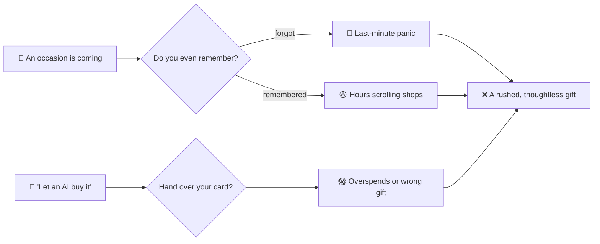
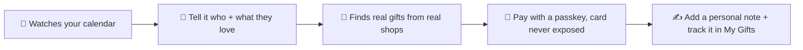
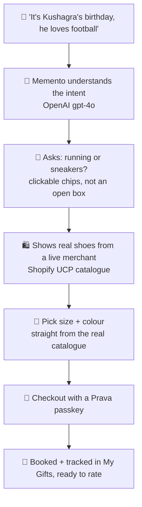
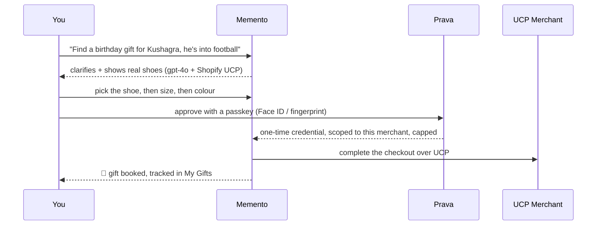
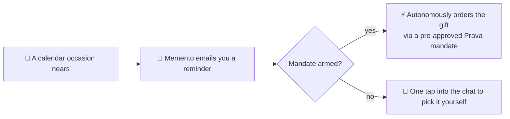
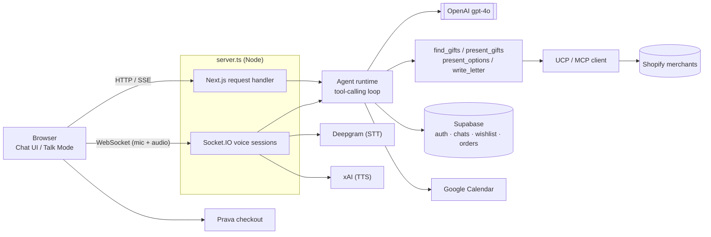

<div align="center">


# 🎁 Memento

### Never miss a gift again. Just talk, and it handles the rest.

**Memento is your AI gifting companion. It watches your calendar, reminds you before every
occasion, finds a real gift by just chatting, and pays for it safely with a passkey.
Your card is never exposed, and the agent can never overspend.**

_OpenAI gpt-4o · Prava scoped-credential payments · Shopify UCP merchants · Google Calendar_

🔗 **Live:** https://drape-o5rh.onrender.com/

</div>

---

## 😩 The problem

We all forget birthdays and anniversaries. And even when we remember, we lose hours scrolling
shops for something halfway decent. Now the "let an AI buy it for you" tools want you to just hand
over your card and hope it does not overspend or pick the wrong thing.



> The gift is not the hard part. **Remembering, choosing, and trusting** is.

---

## 💡 The solution — Memento

You do not fill forms or scroll grids. You **talk to Memento like a thoughtful friend**, and it does
the remembering, the finding, and the paying, safely.



---

## 🎬 What one session actually feels like

No search bar, no filters. A conversation.



And the flow underneath, end to end:



---

## 📅 The autonomous part — it can remember *for* you

Sign in with Google and Memento reads your **Google Calendar**. Every birthday, anniversary, and
festival is now something it knows about.



> Today it **reminds you and finds the gift in seconds**. Next, with a **Prava mandate** approved once
> by a passkey, it can **order the gift on its own** when the day comes, scoped and capped, so you
> genuinely never miss one again.

---

## 🔐 Payments that don't ask you to trust the model

There is **no card field anywhere in Memento**. When you check out, a separate **Prava** window opens.

- Approve with a **passkey**. Your real card number **never touches Memento or the merchant**.
- Prava issues a **one-time credential, scoped to that one merchant and capped at that one amount**,
  so even the agent **cannot overspend**.
- We attempt the **real merchant checkout** over UCP and report the outcome **honestly** (sandbox:
  no funds move).

> Consent moves to policy time, not transaction time. Enforcement lives in the credential, not in a prompt.

---

## 🚀 What you get

- 💬 **A conversational gifting agent** — a tool-calling **OpenAI gpt-4o** agent that asks only for what it's missing (relationship, interests, budget), searches, and narrows to a few genuinely good picks instead of dumping a keyword-matched list.
- 🎙️ **Talk mode** — a real **voice** conversation (**Deepgram** speech-to-text + **xAI** text-to-speech over a WebSocket), with barge-in interruption and clickable option chips.
- 🛍️ **Real merchant catalogues** — gift search fans out in parallel to real Shopify stores over **Shopify UCP / MCP**, with real **size and colour** variants you pick before paying. Not a mock list.
- 📅 **Google Calendar aware** — connect your calendar and Memento proactively surfaces the nearest upcoming occasion.
- ✍️ **A personal note** — the agent writes a warm, specific card message addressed to the recipient, never a template.
- 🔐 **Prava passkey checkout** — scoped one-time credential, honest end-to-end sandbox flow.
- 🧾 **My Gifts** — track every gift from wrapped to delivered, and rate it with a star review.
- ❤️ **Wishlist** — heart any gift to save it; chat history persists for signed-in users, and a guest chat imports on sign-up.

---

## 🧱 Architecture



---

## 🧠 How it's built · run it locally

<details>
<summary><b>Tech stack</b></summary>

<br/>

- **Framework**: Next.js 16 (App Router) + React + TypeScript, styled with **Tailwind CSS v4**
- **Server**: a custom `server.ts` wrapping Next.js so it can also host a **Socket.IO** server for Talk mode
- **Agent**: **OpenAI gpt-4o** with tool-calling (`find_gifts` / `present_gifts` / `present_options` / `write_letter`)
- **Voice**: **Deepgram** (STT) + **xAI** (TTS)
- **Auth & data**: **Supabase** (auth + Postgres: conversations, orders, wishlist, saved addresses, Google Calendar tokens)
- **Commerce**: **Shopify UCP / MCP** for merchant search, **Prava** sandbox for checkout

> Voice / Talk mode needs the custom `server.ts` (Socket.IO), so it needs a persistent Node host. It
> works on **Render**; on **Vercel** everything works except live voice.

</details>

<details>
<summary><b>Project structure</b></summary>

<br/>

```text
├── server.ts                 <-- Custom server: boots Next.js + Socket.IO together
├── app/
│   ├── page.tsx              <-- Main chat UI (text + Talk mode)
│   ├── calendar/             <-- Upcoming occasions (Google Calendar)
│   ├── wishlist/             <-- Saved gifts
│   ├── my-gifts/             <-- Past orders + reviews
│   ├── checkout/             <-- Prava checkout flow
│   ├── components/           <-- GiftCard, TalkModeOverlay, Sidebar, etc.
│   ├── hooks/useTalkMode.ts  <-- Talk mode client state machine
│   └── api/                  <-- chat (SSE), auth/callback, prava/*
├── lib/
│   ├── agent.ts              <-- System prompt + tool schemas
│   ├── agent-runtime.ts      <-- Shared tool-calling loop (chat + voice)
│   ├── gifts.ts · ucp.ts     <-- Gift search across UCP merchants
│   ├── merchants.ts          <-- Merchant catalogue (UCP endpoints)
│   ├── prava.ts · calendar.ts
│   └── supabase/             <-- client/server helpers, conversations, wishlist, tokens
├── server/voice/             <-- Voice session (Socket.IO), Deepgram STT, xAI TTS
└── supabase/*.sql            <-- Schema — run manually in the Supabase SQL editor
```

</details>

<details>
<summary><b>Run it</b></summary>

<br/>

```bash
npm install
cp .env.example .env.local   # then fill in your keys
npm run dev
```

Keys you will want: `OPENAI_API_KEY`, `NEXT_PUBLIC_SUPABASE_URL`, `NEXT_PUBLIC_SUPABASE_PUBLISHABLE_KEY`,
`PRAVA_SK`, `PRAVA_PK`, `PRAVA_API_BASE`, the Google OAuth vars for calendar, and `DEEPGRAM_API_KEY` /
`XAI_API_KEY` for voice. Everything runs in the **sandbox** — no real money moves.

</details>

---

<div align="center">

**🎁 Memento** — it remembers, it finds the gift by just talking, and it pays safely. So you can be the person who never forgets.

</div>
