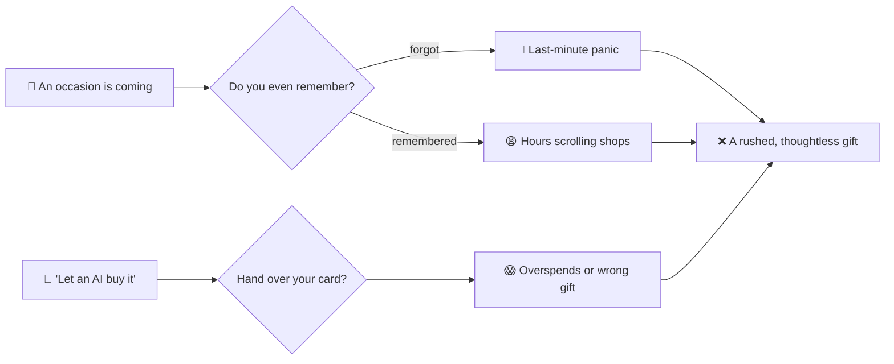
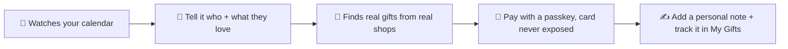
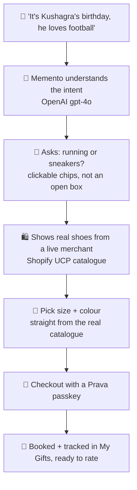
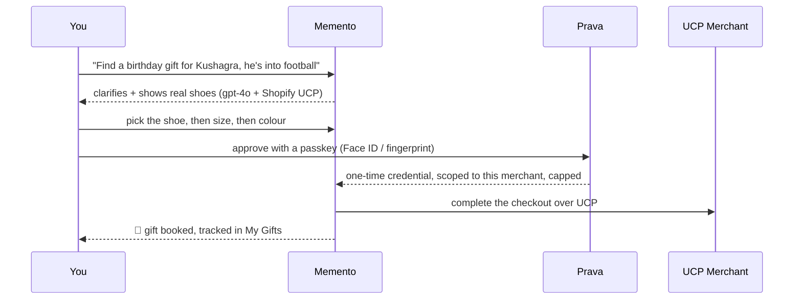
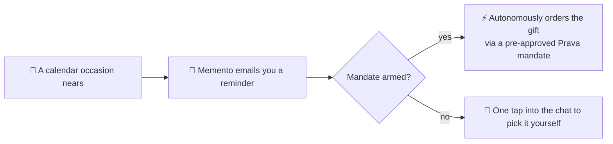

<div align="center">


# 🎁 Memento

### Never miss a gift again. Just talk, and it handles the rest.

**Memento is your AI gifting companion. It watches your calendar, reminds you before every
occasion, finds a real gift by just chatting, and pays for it safely with a passkey.
Your card is never exposed, and the agent can never overspend.**

_OpenAI gpt-4o · Prava scoped-credential payments · Shopify UCP merchants · Google Calendar_

🔗 **Live:** https://drape-piyushagarwal-55s-projects.vercel.app

</div>

---

## 😩 The problem

We all forget birthdays and anniversaries. And even when we remember, we lose hours scrolling
shops for something halfway decent. Now the "let an AI buy it for you" tools want you to just hand
over your card and hope it does not overspend or pick the wrong thing.



> The gift is not the hard part. **Remembering, choosing, and trusting** is.

---

## 💡 The solution — Memento

You do not fill forms or scroll grids. You **talk to Memento like a thoughtful friend**, and it does
the remembering, the finding, and the paying, safely.



---

## 🎬 What one session actually feels like

No search bar, no filters. A conversation.



And the flow underneath, end to end:



---

## 📅 The autonomous part — it can remember *for* you

Sign in with Google and Memento reads your **Google Calendar**. Every birthday, anniversary, and
festival is now something it knows about.



> Today it **reminds you and finds the gift in seconds**. Next, with a **Prava mandate** approved once
> by a passkey, it can **order the gift on its own** when the day comes, scoped and capped, so you
> genuinely never miss one again.

---

## 🔐 Payments that don't ask you to trust the model

There is **no card field anywhere in Memento**. When you check out, a separate **Prava** window opens.

- Approve with a **passkey**. Your real card number **never touches Memento or the merchant**.
- Prava issues a **one-time credential, scoped to that one merchant and capped at that one amount**,
  so even the agent **cannot overspend**.
- We attempt the **real merchant checkout** over UCP and report the outcome **honestly** (sandbox:
  no funds move).

> Consent moves to policy time, not transaction time. Enforcement lives in the credential, not in a prompt.

---

## 🚀 What you get

- 💬 **A conversational gifting agent** — powered by **OpenAI gpt-4o** with real tool-calling: it reads your intent, narrows the choice with clickable options, and searches live shops.
- 🛍️ **Real gifts from real merchants** — live catalogues over **Shopify UCP**, with real **size and colour** variants you pick before paying.
- 📅 **Google Calendar aware** — it sees your upcoming occasions and proactively brings up the nearest one.
- ✍️ **A personal note** — Memento writes a warm, hand-written-style card for the recipient, never a template.
- 🔐 **Prava passkey checkout** — scoped one-time credential, honest end-to-end sandbox flow.
- 🧾 **My Gifts** — track every gift from wrapped to delivered, and rate it with a star review.
- ❤️ **Wishlist** — save gifts to come back to.
- 🎙️ **Talk mode** — a real-time **voice** conversation with the agent (OpenAI Realtime + socket.io).

---

## 🧠 How it's built · run it locally

<details>
<summary><b>Stack</b></summary>

<br/>

**Next.js 16** (App Router) · **OpenAI gpt-4o** (agent + tool calling, and Realtime for voice) ·
**Prava** (agentic scoped-credential payments) · **Shopify UCP over MCP** (live merchant catalogues) ·
**Supabase** (auth + Postgres: conversations, orders, wishlist) · **Google Calendar API** ·
**socket.io** (voice server) · **Tailwind CSS v4** · **TypeScript**.

> Note: voice / Talk mode runs on a custom `server.ts` (socket.io), so it needs a persistent Node
> host. It works on **Render**; on **Vercel** everything works except live voice.

</details>

<details>
<summary><b>Run it</b></summary>

<br/>

```bash
npm install
cp .env.example .env.local   # then fill in your keys
npm run dev
```

Open the local URL and sign in. Keys you will want: `OPENAI_API_KEY`, `NEXT_PUBLIC_SUPABASE_URL`,
`NEXT_PUBLIC_SUPABASE_PUBLISHABLE_KEY`, `PRAVA_SK`, `PRAVA_PK`, `PRAVA_API_BASE`, and the Google
OAuth vars for calendar. Everything runs in the **sandbox** — no real money moves.

</details>

---

<div align="center">

**🎁 Memento** — it remembers, it finds the gift by just talking, and it pays safely. So you can be the person who never forgets.

</div>
