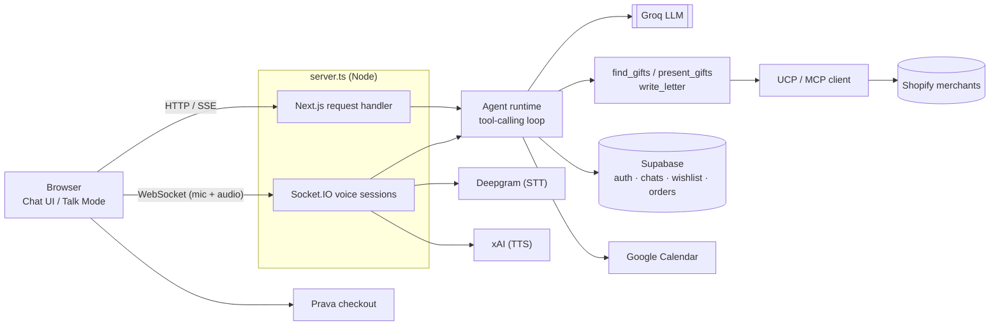

<p align="center">
  
</p>

<h1 align="center">Memento</h1>

Memento is an AI relationship agent — a chat (and voice) assistant that helps you find, personalize, and check out a thoughtful gift for someone in your life, instead of just searching a product catalog.

## Overview

Instead of asking "what mug should I buy," you tell Memento about the *person* — who they are to you, what they're into, the occasion, the budget — and it does the rest: searches real merchant catalogs, picks a short list that actually fits (not just keyword matches), writes a personal note if you want one, and lets you check out with one tap. It also knows your upcoming Google Calendar occasions, so it can proactively bring up a birthday or anniversary before you ask.

Built during a hackathon — some parts (e.g. Prava checkout) run against a sandbox, and scope is intentionally kept tight (see `AGENTS.md`).

## Features

- **Conversational gift-finding** — a tool-calling LLM agent (Groq) that asks for what it's missing (relationship, interests, budget), searches, and narrows to 3–4 genuinely good picks instead of dumping a keyword-matched list.
- **Talk Mode** — a real voice conversation (speech-to-text via Deepgram, text-to-speech via xAI) over a WebSocket, with barge-in interruption and clickable option chips for quick answers.
- **Real merchant catalogs** — gift search fans out in parallel to real Shopify stores over the [UCP](https://shopify.dev/ucp) (Universal Commerce Protocol) / MCP, not a static/mock product list. See `lib/merchants.ts` for the current catalog list.
- **Agentic checkout (Prava)** — one-tap checkout against a sandboxed payment flow; the buyer's real card never touches Memento or the merchant. No real money moves.
- **Wishlist** — heart any gift card to save it; un-hearting it removes it from the wishlist view live.
- **Chat history** — signed-in users get persisted conversations; guests can chat without an account and their session gets imported on sign-up.
- **Google Calendar awareness** — connect your calendar (Supabase-managed Google OAuth) and Memento can proactively surface the nearest upcoming occasion.
- **Personalized letters** — once you approve a gift, the agent can write a warm, specific card message addressed to the recipient.

<p align="center">
  
  <br />
  <sub>The mascot that greets you on empty states — chat, wishlist, login, and Talk Mode each get their own pose.</sub>
</p>

## Tech Stack

- **Framework**: Next.js (App Router, Turbopack) + React + TypeScript
- **Styling**: Tailwind CSS
- **Backend**: a custom Node server (`server.ts`) wrapping Next.js so it can also host a Socket.IO server for Talk Mode
- **LLM**: Groq (`llama-3.3-70b-versatile` by default) with tool-calling for `find_gifts` / `present_gifts` / `present_options` / `write_letter`
- **Auth & data**: Supabase (auth, Postgres tables for conversations, orders, wishlist, saved addresses, Google Calendar tokens)
- **Voice**: Deepgram (STT) + xAI (TTS)
- **Commerce**: Shopify UCP/MCP for merchant search, [Prava](https://prava.space) sandbox for checkout

## Architecture



## Project Structure

```text
momento/
├── server.ts                    <-- Custom server: boots Next.js + Socket.IO together
├── app/
│   ├── page.tsx                 <-- Main chat UI (text + Talk Mode entry point)
│   ├── calendar/                <-- Upcoming occasions, powered by Google Calendar
│   ├── wishlist/                <-- Saved gifts
│   ├── my-gifts/                <-- Past orders
│   ├── checkout/                <-- Prava checkout flow
│   ├── login/                   <-- Auth (Supabase)
│   ├── components/               <-- GiftCard, TalkModeOverlay, Sidebar, ProfileModal, etc.
│   ├── hooks/useTalkMode.ts      <-- Talk Mode client-side state machine
│   └── api/
│       ├── chat/route.ts        <-- Text chat endpoint (SSE stream)
│       ├── auth/callback/       <-- Supabase OAuth callback (also stores Google Calendar tokens)
│       └── prava/               <-- Checkout session + result endpoints
├── lib/
│   ├── agent.ts                 <-- System prompt + tool schemas
│   ├── agent-runtime.ts         <-- Shared tool-calling loop (used by chat route + voice session)
│   ├── gifts.ts                 <-- Fans out gift search across merchants
│   ├── merchants.ts             <-- Merchant catalog (UCP endpoints)
│   ├── ucp.ts                   <-- Minimal UCP/MCP client
│   ├── prava.ts                 <-- Prava checkout session helpers
│   ├── calendar.ts              <-- Google Calendar event fetching/formatting
│   ├── voice/                   <-- Client-side audio capture/playback
│   └── supabase/                <-- client/server Supabase helpers, conversations, wishlist, Google tokens
├── server/voice/                <-- Voice session (Socket.IO), Deepgram STT, TTS
└── supabase/*.sql                <-- Schema — run manually in the Supabase SQL editor (no migration tooling)
```

## Getting Started

### 1. Install dependencies

```bash
npm install
```

### 2. Configure environment variables

Copy `.env.example` to `.env.local` and fill in the values:

```bash
cp .env.example .env.local
```

| Variable | Needed for |
| --- | --- |
| `GROQ_API_KEY`, `GROQ_MODEL` | The chat/voice agent |
| `PRAVA_SK`, `PRAVA_PK`, `PRAVA_API_BASE` | Checkout (required — session creation throws without `PRAVA_SK`) |
| `DEEPGRAM_API_KEY`, `XAI_API_KEY` | Talk Mode (speech-to-text / text-to-speech) |
| `NEXT_PUBLIC_SUPABASE_URL`, `NEXT_PUBLIC_SUPABASE_PUBLISHABLE_KEY` | Auth, chat history, wishlist, orders |
| `GOOGLE_CLIENT_ID`, `GOOGLE_CLIENT_SECRET`, `GOOGLE_REDIRECT_URI` | Google Calendar integration — the redirect URI must exactly match an Authorized redirect URI in the Google Cloud Console |

### 3. Set up Supabase tables

Run each file under `supabase/` (`chat_history.sql`, `orders.sql`, `saved_addresses.sql`, `wishlist.sql`) in your Supabase project's SQL editor — there's no migration tooling in this repo, so this is a manual, one-time step per environment.

### 4. Run the dev server

```bash
npm run dev
```

Open [http://localhost:3000](http://localhost:3000). Note that `dev`/`start` run the custom `server.ts` (not plain `next dev`), since it also stands up the Socket.IO server Talk Mode depends on.

## Scripts

- `npm run dev` — start the dev server (custom server + Turbopack)
- `npm run build` — production build
- `npm run start` — run the production build
- `npm run lint` — ESLint
